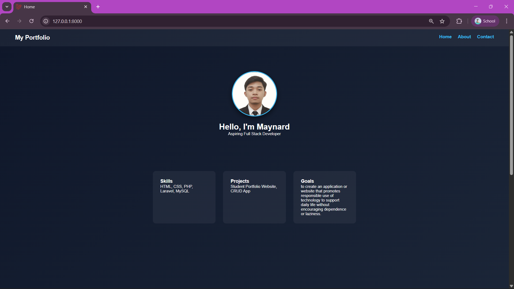
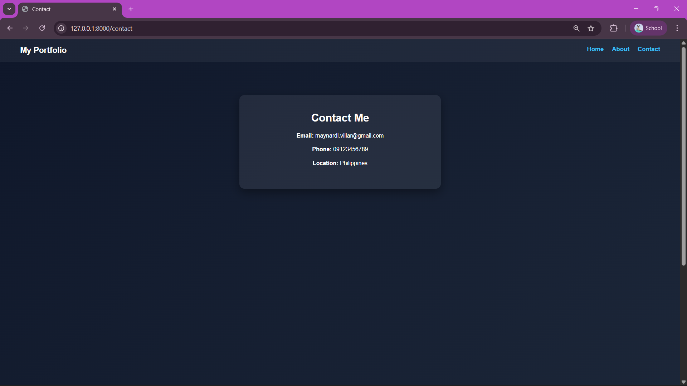

This is my simple multi page portfolio web application built using Laravel.
In this project, I used controllers, routes and Blade templates to create a structured and organized web application.

My website contains a main portfolio page (Home) and two additional pages (About and Contact). Each page is handled by its own controller and rendered using Blade templates. I also added custom CSS styling to improve the design and layout.

I developed this project as part of Laboratory 3 to practice Laravel fundamentals such as routing, MVC structure and Blade templating.

